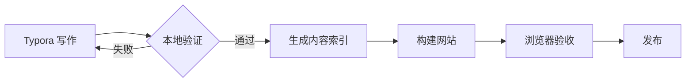
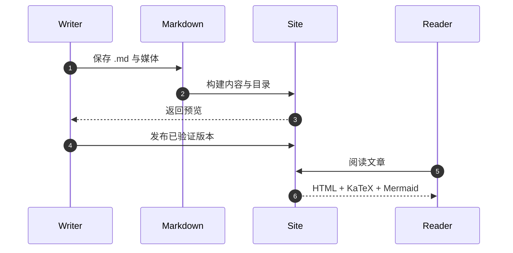

这篇文章不是功能清单，而是一份可以长期保留的**渲染验收样本**。我会在 Typora 中常用的语法和网页输出之间建立一条可重复验证的路径。

> 写作格式的价值，不在于语法多，而在于文件离开编辑器之后仍能完整表达。

## 基础排版与 GFM

一段文字可以同时包含**粗体**、*斜体*、~~删除线~~、`inline code` 和 [外部链接](https://typora.io/)。

- 第一层列表
  - 第二层列表
    - 第三层列表
- 列表之后仍然保持稳定的段落节奏

1. 写作
2. 本地预览
3. 发布与验证

- [x] 标题、引用、列表和代码
- [x] 表格、删除线与任务列表
- [x] 数学公式与 Mermaid
- [ ] 用新的真实文章继续回归测试

| 能力 | 写法 | 网页表现 |
| --- | :---: | ---: |
| GFM | `remark-gfm` | 已验证 |
| 数学公式 | `$...$` / `$$...$$` | KaTeX |
| 图表 | Mermaid fenced code | SVG |

## 语义警告框

> [!NOTE]
> 普通补充信息会显示为「提示」。

> [!TIP]
> 推荐做法会显示为「建议」。

> [!WARNING]
> 需要关注的风险会显示为「告警」。

> [!CAUTION]
> 可能造成严重后果的操作会显示为「警示」。

## 数学公式

行内公式会和文字一起流动，例如注意力的缩放项 $\frac{QK^\top}{\sqrt{d_k}}$。

块级公式支持多行对齐：

$$
\begin{aligned}
\operatorname{Attention}(Q,K,V)
  &= \operatorname{softmax}\left(\frac{QK^\top}{\sqrt{d_k}}\right)V \\
K_{\text{cache}}^{(t)}
  &= [K_{\text{cache}}^{(t-1)}; K_t] \\
V_{\text{cache}}^{(t)}
  &= [V_{\text{cache}}^{(t-1)}; V_t]
\end{aligned}
$$

矩阵也能正常显示：

$$
X =
\begin{bmatrix}
1 & 0 & 1 \\
0 & 1 & 0 \\
1 & 1 & 1
\end{bmatrix}
$$

## Mermaid 流程与时序

所有 Mermaid 图表固定使用「中性」主题。每张图都可以在「图表」与「Code」之间切换：前者用于阅读，后者用于检查或复制原始 Mermaid 语法。

下面的流程图描述本地写作到发布的闭环：



同一篇文章里可以继续放更复杂的时序图：



## 多语言代码高亮

同一种内容结构，在不同语言里应该保留各自可辨识的关键字、类型、字符串、注释与数字层级。

### TypeScript

```typescript
type Post<TMeta extends Record<string, unknown>> = {
  slug: string;
  meta: TMeta;
};

async function publish<TMeta extends Record<string, unknown>>(
  post: Post<TMeta>,
): Promise<string> {
  const response = await fetch(`/api/posts/${post.slug}`, {
    method: "POST",
    body: JSON.stringify(post.meta),
  });
  return response.ok ? "published" : "failed";
}
```

### Python

```python
from dataclasses import dataclass
from pathlib import Path

@dataclass(frozen=True)
class Article:
    title: str
    source: Path

def published_titles(articles: list[Article]) -> list[str]:
    return [article.title for article in articles if article.source.exists()]
```

### Rust

```rust
#[derive(Debug)]
struct Entry<'a> {
    title: &'a str,
    pinned: bool,
}

fn pinned_titles(entries: &[Entry<'_>]) -> Vec<&str> {
    entries.iter()
        .filter(|entry| entry.pinned)
        .map(|entry| entry.title)
        .collect()
}
```

### Go

```go
func renderAll(ctx context.Context, slugs []string) <-chan Result {
	results := make(chan Result)
	go func() {
		defer close(results)
		for _, slug := range slugs {
			results <- render(ctx, slug)
		}
	}()
	return results
}
```

### SQL

```sql
WITH ranked_posts AS (
  SELECT
    title,
    topic,
    ROW_NUMBER() OVER (PARTITION BY topic ORDER BY published_at DESC) AS rank
  FROM posts
  WHERE status = 'published'
)
SELECT title, topic
FROM ranked_posts
WHERE rank <= 3;
```

### Swift

```swift
actor ReadingProgress {
    private var offsets: [URL: Double] = [:]

    func save(_ offset: Double, for article: URL) {
        offsets[article] = max(0, offset)
    }

    func restore(for article: URL) -> Double {
        offsets[article, default: 0]
    }
}
```

## Diff、图片与原生 HTML

```diff
- const publishing = "copy and paste";
+ const publishing = "content as source";
```


<details>
  <summary>展开原生 HTML 内容</summary>
  <p>Typora 文件中的 details / summary 会保留为可交互的折叠区域。</p>
</details>

---

最后用一个脚注说明这篇文章的角色：它既是示例，也是未来升级 Markdown 依赖时的回归测试。[^regression]

[^regression]: 页面构建测试会检查公式与示例内容，浏览器验收会检查 Mermaid 是否被转换为 SVG。
