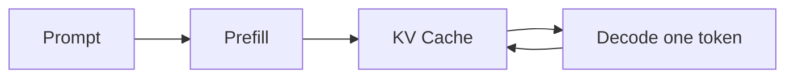

理解 KV Cache 最直观的方式，是先看自回归生成里那些被重复计算的部分。

## Prefill 与 Decode

Prefill 一次处理完整提示词，Decode 则每次只生成一个新 token。

## 缓存的是什么

过去 token 对应的 Key 和 Value 不会因为新 token 到来而变化，所以可以保存下来，只计算新位置的投影。

## 空间换时间

缓存减少计算，却增加显存占用。批量、序列长度与层数共同决定了这笔开销。

$$
\text{KV memory} \propto 2 \times L \times H \times T
$$
