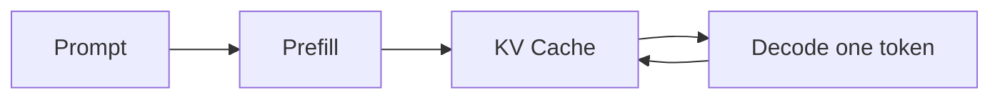

理解 KV Cache 最直观的方式，是先看自回归生成里那些被重复计算的部分。

朴素 decode 每步都会把过去 token 再投影一遍。6 个 token 共 21 次计算，其中 15 次是浪费：

```widget
src: ./understand-kv-cache/waste.html
caption: 朴素 decode 每步重算全部过去 token；6 个 token 共 21 次计算，其中 15 次是浪费。
```

## Prefill 与 Decode

Prefill 一次处理完整提示词，Decode 则每次只生成一个新 token。拓扑用 Mermaid 一次说清；要停在某一拍看 Q/K/V 怎么变，用旁边的步进图。



```widget
src: ./understand-kv-cache/stepper.html
caption: Prefill 一次写满 K/V；Decode 每步只追加一行；末步 21 次投影变成 7 次。
```

## 缓存的是什么

过去 token 对应的 Key 和 Value 不会因为新 token 到来而变化，所以可以保存下来，只计算新位置的投影。

## 空间换时间

缓存减少计算，却增加显存占用。批量、序列长度与层数共同决定了这笔开销。把 batch 拧到 8、序列看到 32K，消费卡会先被 KV 撑满。

$$
\text{KV memory} \propto 2 \times L \times H \times T
$$

```widget
src: ./understand-kv-cache/memory.html
caption: 70B 在长上下文下，KV 显存会先于权重撑满一张卡；batch 8 × 32K 时连 7B 也超过消费卡。
```

同一组数量级也可以收成一页附件。页面和 PDF 默认只显示入口，需要时再展开：

```widget
src: ./understand-kv-cache/sheet.html
caption: KV 显存与层数、头维、序列和 batch 成正比；70B 长上下文会先于权重量满一张卡。
```

```widget
src: ./understand-kv-cache/notes.pdf
caption: 同一页公式的 PDF；适合下载或打印，不必在正文里摊开整页阅读器。
```
