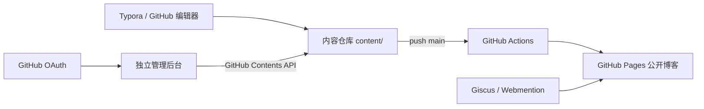

# 技术架构

## 两个部署边界

公开博客是静态输出：构建期读取 `content/`，生成路由、搜索索引、RSS、sitemap、robots 和媒体副本。GitHub Pages 不需要也不会保存 OAuth、PAT 或数据库凭据。

后台是可选的独立服务。它保存短期会话、使用 GitHub OAuth 验证登录用户是否在白名单，然后使用服务器端 `CONTENT_GITHUB_TOKEN` 创建或更新 Markdown。内容的权威副本始终在 Git 仓库。

## 代码模块

| 位置 | 职责 |
| --- | --- |
| `content/` | 唯一内容源 |
| `scripts/build-content.mjs` | 校验、媒体复制、内容索引、静态订阅文件 |
| `app/` | Next/Vinext 阅读页、Markdown 渲染、搜索与后台接口 |
| `.github/workflows/pages.yml` | GitHub Pages 静态构建与发布 |
| `.github/workflows/verify.yml` | lint、测试与静态导出验收 |

## 安全边界

公开构建只读取 Actions Variables（例如 `SITE_URL`），不读取后台 Secret。OAuth Client Secret、会话密钥、GitHub PAT 与外部平台令牌只保存于后台服务的 Secret。内容仓库中不得出现任何真实令牌或 `.env.local`。
