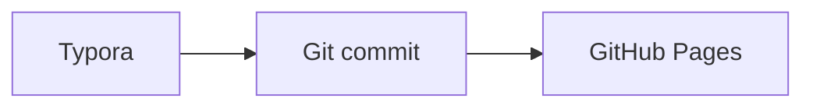

# 内容编写与 Typora

## Front matter

普通博文最小示例：

```md
---
title: 我的文章
slug: my-post
date: 2026-07-25T09:00:00+08:00
description: 一句话摘要。
topic: 写作
tags: [Markdown, 写作]
pinned: false
cover: ./assets/cover.jpg
---

正文从这里开始。
```

专栏文章需要额外提供 `column`、`columnTitle`、`columnDescription` 与从 1 开始的 `order`。随想只需 `title`、`slug`、`date`，可选 `tags` 和 `media`。

## 本地附件

相对路径可在 Typora 与网页中同时工作：

```md


<video controls src="./assets/demo.webm"></video>
```

构建会验证文件存在、复制到公开目录并改写 URL。链接、远程媒体及以 `/` 开头的站内路径保持原样。

## 多媒体随想

```yaml
media:
  - type: image
    src: ./assets/photo-1.jpg
    alt: 雨后的街道
  - type: image
    src: ./assets/photo-2.jpg
  - type: audio
    src: ./assets/rain.mp3
    title: 雨声
  - type: video
    src: ./assets/walk.webm
    mime: video/webm
  - type: link
    src: https://example.com
    title: 延伸阅读
```

## 草稿、定时与置顶

```yaml
draft: true
publishAt: 2026-08-01T09:00:00+08:00
pinned: true
```

正式构建会跳过 `draft: true` 和未到 `publishAt` 的内容。置顶只适用于普通博文列表；修改 front matter 并提交就是唯一操作。

## Mermaid 与公式

````md
行内公式 $E=mc^2$，块级公式：

$$
\int_0^1 x^2 dx = \frac{1}{3}
$$


````
