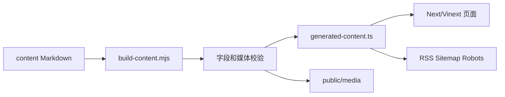
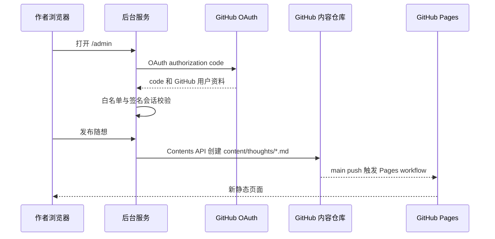

# 系统实现：从 Markdown 到已发布页面

本文描述代码层面的实现，不是功能清单。目标是让维护者能回答三个问题：内容如何进入页面、页面如何变成 GitHub Pages 文件、后台为何不需要数据库。

## 1. 仓库是内容数据库

系统没有 CMS 数据库。`content/` 是唯一真源，Git 提交是内容版本与审计记录。

```text
content/posts/*.md                 普通博文
content/columns/<column>/*.md      专栏文章
content/thoughts/*.md              随想
content/**/assets/*                与 Markdown 同目录的本地媒体
```

每个文件由 YAML front matter 和 Markdown 正文组成。以博文为例，`title`、`slug`、`date`、`description`、`topic` 是构建时校验字段；`pinned`、`cover`、`tags`、`draft`、`publishAt` 等字段决定列表、封面和可见性。

这意味着“置顶”不是后台状态，而是 `pinned: true` 的一次 Git 变更；“发布”则是把内容提交到 `main`。因此回滚、比较、多人协作与备份都复用 Git 本身。

## 2. 内容编译器

构建前，npm 的 `prebuild` 会执行 `scripts/build-content.mjs`。这个 Node 脚本完成下列工作：

1. 递归读取三种内容目录，并用 `gray-matter` 分离 front matter 与正文。
2. 校验 slug、日期、专栏顺序、媒体类型、重复路径与必填字段。
3. 排除 `draft: true` 和未到 `publishAt` 的内容；`CONTENT_INCLUDE_DRAFTS=1` 仅用于本地预览。
4. 扫描 Markdown 图片和原生 `img/audio/video/source` 标签，以及 `cover`、`poster`、`media[].src`。相对路径媒体会被复制到 `public/media/`，正文中的 URL 同步改写为公开路径。
5. 将归一化结果写入 `app/lib/generated-content.ts`。该文件含类型、博文、专栏、随想数组与内容哈希，运行时不再读取文件系统。
6. 由同一份数组生成 `public/rss.xml`、`public/sitemap.xml`、`public/robots.txt`。



`app/lib/content.ts` 是页面使用的轻量查询层：它从生成数组导出 `findPost`、`findThought`、`findColumnEntry`，并计算标题锚点、字数和搜索记录。静态页面因此不需要数据库查询，也不会在访问时重新解析 Markdown。

## 3. 阅读页面和 Markdown 渲染

路由在 `app/` 中按内容类型拆分：

```text
app/blog/[slug]/page.tsx              博文详情
app/columns/[column]/[slug]/page.tsx  专栏详情
app/thoughts/[slug]/page.tsx          随想详情
```

详情页的 `generateStaticParams()` 从生成数组返回所有路径，因此静态导出时会为每篇内容生成 HTML。页面通过 `extractHeadings()` 从二、三级标题建立右侧目录，通过 `estimateWordCount()` 计算字数；专栏页额外从同一 `column` 的条目建立左侧篇目。

`MarkdownArticle` 使用 `react-markdown` 管理 AST 渲染，插件链如下：

```text
remark-gfm       表格、任务列表、脚注、删除线
remark-breaks    Typora 式软换行
remark-math      识别 TeX
rehype-raw       保留受支持的原生 HTML
rehype-katex     输出数学公式
rehype-slug      为标题生成 id
rehype-autolink-headings  标题锚点
rehype-highlight 代码高亮
```

当代码块语言为 `mermaid` 时，组件会交给 `MermaidDiagram`：客户端动态加载 Mermaid，固定中性主题，并在“图表”和“Code”两个视图之间切换。普通代码块则保留语言标记供样式层显示。

搜索索引不依赖第三方服务。`content.ts` 将 Markdown 去掉标记形成标题、摘要、正文文本，客户端用 Fuse.js 模糊匹配，再根据 Fuse 的匹配范围包装高亮片段。

## 4. GitHub Pages 静态发布

公开端通过 `STATIC_EXPORT=1` 启动构建。`next.config.ts` 在此模式开启 `output: "export"`、结尾斜杠和未优化图片；`/admin` 则被导出为一个指向独立后台的说明页，API 路由不会进入 Pages 产物。

`.github/workflows/pages.yml` 的关键顺序是：

```text
checkout
  -> Node 22 + npm ci
  -> 写入 SITE_URL / 静态导出环境变量
  -> npm run build
  -> 上传 dist/client
  -> actions/deploy-pages
```

GitHub Pages 只托管静态文件，故公开页面不包含 OAuth Client Secret、PAT 或分发令牌。工作流只允许根路径仓库 `<owner>.github.io`，或已配置 `SITE_URL` 的自定义域名运行；这避免项目子路径与静态动态路由混用造成链接错误。

`verify.yml` 在 PR 与 `main` 上先跑 lint、普通构建测试，再额外运行一次静态导出。也就是说内容和后台代码即使本地服务能启动，也必须通过 Pages 产物验证。

## 5. 独立后台的请求链路

后台使用同一份应用代码，但必须部署到支持服务端路由的运行时；它不是 GitHub Pages 的一部分。



### 身份认证

`app/api/auth/github/route.ts` 生成随机 `state` 并写入 HttpOnly、Secure、SameSite=Lax Cookie。回调路由交换 `code` 获取 GitHub 用户资料，再按 `ADMIN_GITHUB_LOGINS` 检查 login。

通过后，`app/lib/admin-auth.ts` 将 `{ login, avatarUrl, expiresAt }` Base64URL 编码，以 `GITHUB_SESSION_SECRET` 做 HMAC-SHA256 签名，写入七天有效期的 HttpOnly Session Cookie。每个 `/api/admin/*` 路由先调用 `requireAdminApi()`：重新验签、检查过期，并再次校验白名单。OAuth access token 不会写入浏览器 Session，也不承担仓库写入权限。

### 随想写入

`app/lib/github-content.ts` 使用 GitHub Contents API：

- 列表：读取 `content/thoughts` 目录，逐个获取 Base64 文件并解析 front matter。
- 新建：生成 slug，将 front matter + Markdown UTF-8 Base64 编码，`PUT /repos/{owner}/{repo}/contents/...`。
- 撤回：用原文件 SHA 更新 `draft: true`；重新发布则清除草稿并更新时间。
- 删除：带 SHA 调用 Contents API 的 DELETE。
- 媒体：`/api/admin/uploads` 将小于 10 MB 的图片、音频或视频写入 `content/uploads/`；随想以 `../uploads/<file>` 引用，Pages 构建时自动复制到公开 `media/`。

写入使用后台的 `CONTENT_GITHUB_TOKEN`（Fine-grained PAT，限定目标仓库且仅 Contents Read/Write）。因此登录用户只证明“谁在操作”，服务端 PAT 才是“能写入哪里”的最小权限凭据。GitHub API 创建的提交进入 `main` 后，自然触发公开端的 Pages 工作流。

## 6. 评论、Webmention 与分发

评论是纯前端嵌入的 Giscus iframe；配置在构建期注入，评论正文保存于 GitHub Discussions。Webmention 接收端读取 webmention.io 的公开 API，发送端 `scripts/send-webmentions.mjs` 扫描 RSS 外链；`webmentions.yml` 允许在页面上线后手动触发。

后台分发路由不复制或保存正文：X 使用 `X_USER_ACCESS_TOKEN` 调用其发帖 API；CSDN、知乎、掘金只把 `{ title, markdown, summary, canonicalUrl, tags }` POST 给自建 webhook。没有对应凭据时返回 `needs_credentials`，前端保留复制分发包的人工降级路径。

## 7. 维护时的改动入口

| 想改什么 | 修改位置 |
| --- | --- |
| 站点名称、作者、GitHub、默认文案 | `site.config.json` |
| 内容格式、媒体校验、生成 RSS | `scripts/build-content.mjs` |
| Markdown 语法或 Mermaid 行为 | `app/components/MarkdownArticle.tsx`、`MermaidDiagram.tsx` |
| 文章布局与目录 | 对应的 `app/blog`、`app/columns`、`TableOfContents.tsx` |
| 搜索权重或高亮 | `app/lib/content.ts`、搜索组件 |
| 后台随想 Git 写入 | `app/lib/github-content.ts` 与 `app/api/admin/thoughts/*` |
| 后台媒体上传 | `app/api/admin/uploads` 与 `app/lib/github-content.ts` |
| 登录、会话、后台权限 | `app/lib/admin-auth.ts` 与 `app/api/auth/github/*` |
| 公开部署 | `.github/workflows/pages.yml` |

任何内容或系统改动提交前都运行 `npm run lint && npm test`；如果改动到公开部署边界，再显式执行 `STATIC_EXPORT=1 SITE_URL=https://example.github.io ADMIN_URL=https://admin.example.com npm run build`。
