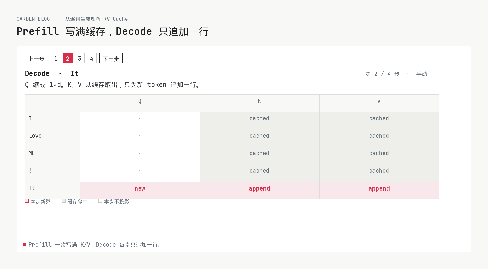
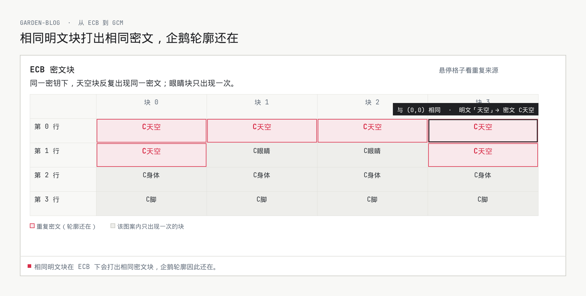
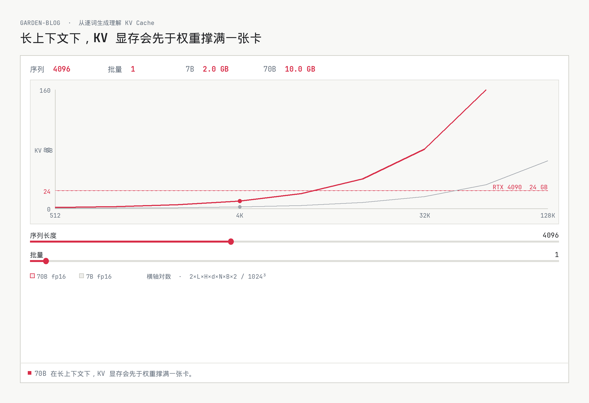
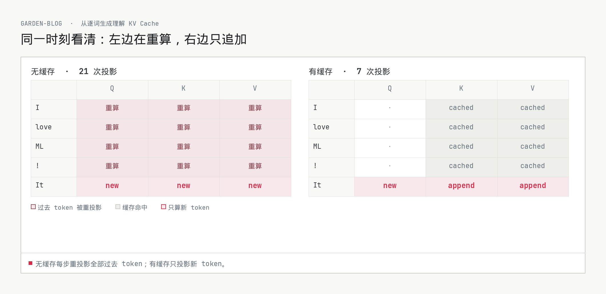
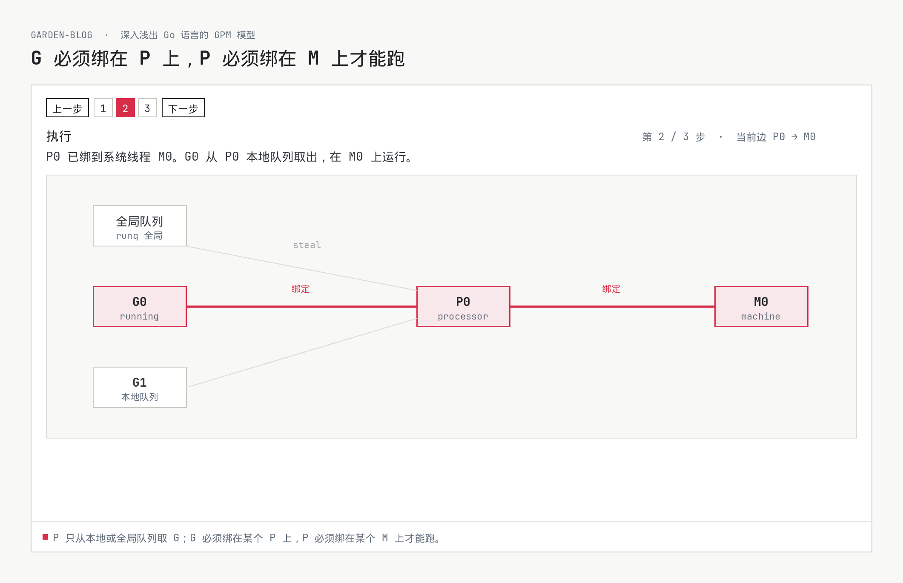
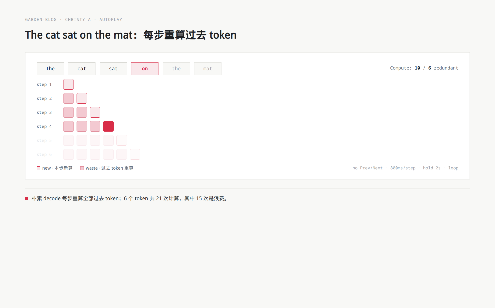
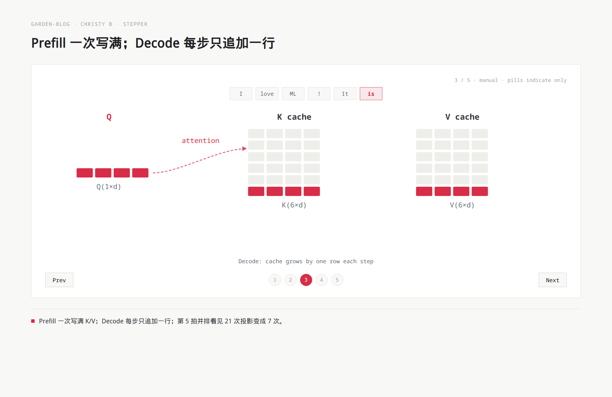
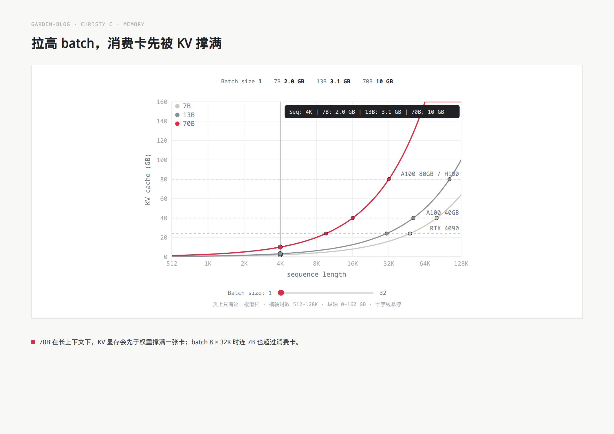

# 五种 widget kind 的完整例子

给作者抄。每种原语一份可粘贴的 `widget` 围栏，并写明 Typora 看见什么、成页看见什么、关 JS / RSS 看见什么。语法与约束见 [interactive-blog-components.md](./interactive-blog-components.md)。这里不实现产品，也不写 JSX。

作者只声明数据：选 `kind`、填教学表、写一句判断性的 `caption`。外观、无障碍、降级表格由站点生成。对照 [Christy 原文](https://www.christyjacob.dev/blog/kv-caching) 三个 widget 的完整行为副本见文末；复刻规则：行为 100% 一致，只换颜色与 Garden 浅色纸面。不新开 `autoregressive-waste` 这类文章私有 kind。

---

## 共用约定

- 第三种围栏，和 `mermaid` / `embed` 平级。围栏语言是 `widget`，正文是 YAML。
- 必填只有 `kind` 与 `caption`。`caption` 必须是判断，不能是「见下图」；搜索、RSS、无 JS、Typora 都靠它。
- Typora 里 `widget` **就是一块 YAML 代码块**，和今天的 `embed` 一样可读、可改、可复制。
- 成页跟 Garden 浅色纸面走（`--paper` / `--font-mono` / 强调色），不跟参考文的暗色电影感走。
- 示意是设计稿，不是已上线组件。

---

## 1. `stepper`：从逐词生成理解 KV Cache

### 何时用

读者卡在「过程被拍成一张图」（局限 1.1）：Prefill → Decode、Raft 选举、反向传播四步，必须停在某一拍才能复述发生了什么。

### 作者粘贴的 Typora 源码

````md
```widget
kind: stepper
mode: manual
caption: Prefill 一次写满 K/V；Decode 每步只追加一行。
steps:
  - label: Prefill
    note: 提示词 I love ML ! 并行算完全部 Q、K、V。
    grid:
      rows: [I, love, ML, "!"]
      cols: [Q, K, V]
      cells: all-new
  - label: Decode · It
    note: Q 缩成 1×d。K、V 从缓存取出，只为新 token 追加一行。
    grid:
      rows: [I, love, ML, "!", It]
      cols: [Q, K, V]
      cells:
        Q: [idle, idle, idle, idle, new]
        K: [cached, cached, cached, cached, append]
        V: [cached, cached, cached, cached, append]
  - label: Decode · is
    note: Q 仍是 1 行。K/V 缓存再长一行。
    grid:
      append: [is]
      cells: new-last-row
  - label: Decode · great
    note: 缓存继续增长；过去 token 不再投影。
    grid:
      append: [great]
      cells: new-last-row
```
````

同一 `kind` 也可改数据讲 Raft 选举或反向传播「从后往前分锅」，不必新开 kind。

### Typora 里看见什么

一块标了 `widget` 的 **YAML 代码块**。作者改的是步骤、`note` 和格子标记，不是按钮或颜色。预览不会注水成步进器。

### 成页看见什么

`<figure>` 里的手动步进器：上一步 / 1–4 / 下一步，当前步的 `label` 与 `note`，以及可随步高亮的 Q/K/V 格子。自动播放若打开，必须可关，并尊重减少动态。外观跟 `embed` 一样用说明条，不跟暗色卡片走。



### 无 JS / RSS / Typora 降级

`caption` 加由 `steps` 生成的表。订阅者和关脚本的人至少读到判断，再按行看每一拍。

| 步 | 标签 | 读者停在这一拍时读什么 |
| --- | --- | --- |
| 1 | Prefill | 提示词 I love ML ! 并行算完全部 Q、K、V。 |
| 2 | Decode · It | Q 缩成 1×d。K、V 从缓存取出，只为新 token 追加一行。 |
| 3 | Decode · is | Q 仍是 1 行。K/V 缓存再长一行。 |
| 4 | Decode · great | 缓存继续增长；过去 token 不再投影。 |

---

## 2. `inspect-grid`：从 ECB 到 GCM

### 何时用

读者卡在「二维结构被压成表格或图片」（局限 1.3）：ECB 企鹅、Attention 分数、KV 行追加、页锁 bitmap。格子本身是主角，不是某一步的附件。

### 作者粘贴的 Typora 源码

````md
```widget
kind: inspect-grid
caption: 相同明文块在 ECB 下会打出相同密文块，企鹅轮廓因此还在。
title: ECB 密文块
rows: [第 0 行, 第 1 行, 第 2 行, 第 3 行]
cols: [块 0, 块 1, 块 2, 块 3]
cells:
  - { row: 0, col: 0, mark: repeat, plain: 天空, cipher: C天空 }
  - { row: 0, col: 1, mark: repeat, plain: 天空, cipher: C天空 }
  - { row: 0, col: 2, mark: repeat, plain: 天空, cipher: C天空 }
  - { row: 0, col: 3, mark: repeat, plain: 天空, cipher: C天空 }
  - { row: 1, col: 0, mark: repeat, plain: 天空, cipher: C天空 }
  - { row: 1, col: 1, mark: unique, plain: 眼睛, cipher: C眼睛 }
  - { row: 1, col: 2, mark: unique, plain: 眼睛, cipher: C眼睛 }
  - { row: 1, col: 3, mark: repeat, plain: 天空, cipher: C天空 }
  - { row: 2, col: 0, mark: unique, plain: 身体, cipher: C身体 }
  - { row: 2, col: 1, mark: unique, plain: 身体, cipher: C身体 }
  - { row: 2, col: 2, mark: unique, plain: 身体, cipher: C身体 }
  - { row: 2, col: 3, mark: unique, plain: 身体, cipher: C身体 }
  - { row: 3, col: 0, mark: unique, plain: 脚, cipher: C脚 }
  - { row: 3, col: 1, mark: unique, plain: 脚, cipher: C脚 }
  - { row: 3, col: 2, mark: unique, plain: 脚, cipher: C脚 }
  - { row: 3, col: 3, mark: unique, plain: 脚, cipher: C脚 }
hover:
  shows: [plain, cipher, mark]
legend:
  repeat: 与 (0,0) 相同的密文，轮廓还在
  unique: 该图案内只出现一次的块
```
````

### Typora 里看见什么

一块 **YAML 代码块**。作者看见行列名和每格的 `mark` / 明文 / 密文，确认「哪些格重复」写对了。鼠标悬停和颜色不是作者写的。

### 成页看见什么

一张可悬停的检视格：重复密文用站点强调色标出，独特块保持浅纸底。移到一格，格子说话——例如「与 (0,0) 相同 · 明文『天空』→ 密文 C天空」。说明写在 figure 底部。



### 无 JS / RSS / Typora 降级

`caption` 加由 `cells` 生成的表。没有悬停，重复关系仍在表里。

| 行 | 块 0 | 块 1 | 块 2 | 块 3 |
| --- | --- | --- | --- | --- |
| 第 0 行 | C天空（重复） | C天空（重复） | C天空（重复） | C天空（重复） |
| 第 1 行 | C天空（重复） | C眼睛 | C眼睛 | C天空（重复） |
| 第 2 行 | C身体 | C身体 | C身体 | C身体 |
| 第 3 行 | C脚 | C脚 | C脚 | C脚 |

---

## 3. `param-bench`：KV 显存墙（也可换浮点死例子）

### 何时用

读者卡在「参数是死例子」（局限 1.2）：KV 显存公式、`0.1+0.2`、学习率 warmup 步数。页面上的数字是作者算好的；读者改 batch 或序列只能自己掏计算器。

### 作者粘贴的 Typora 源码

````md
```widget
kind: param-bench
caption: 70B 在长上下文下，KV 显存会先于权重撑满一张卡。
inputs:
  - id: seq
    label: 序列长度
    min: 512
    max: 131072
    default: 4096
    scale: log
  - id: batch
    label: 批量
    min: 1
    max: 32
    default: 1
outputs:
  - id: mem_7b
    label: 7B KV (GB)
    formula: 2 * 32 * 32 * 128 * seq * batch * 2 / (1024^3)
  - id: mem_70b
    label: 70B KV (GB)
    formula: 2 * 80 * 64 * 128 * seq * batch * 2 / (1024^3)
view: line
series:
  - { id: mem_7b, label: 7B fp16 }
  - { id: mem_70b, label: 70B fp16 }
refs:
  - { label: RTX 4090, y: 24 }
```
````

公式只许白名单算术（`+ - * / ()`）和已声明的 `id`。浮点文可换成查找表：输入 `float32` / `float64`，输出 `0.1+0.2` 的字面量与是否等于 `0.3`，不要在 YAML 里写 JS。

默认 `seq=4096`、`batch=1` 时：7B = 2.0 GB，70B = 10.0 GB。`seq=32768`、`batch=8` 时 70B 到 640 GB，一张消费卡先被 KV 撑满。

### Typora 里看见什么

一块 **YAML 代码块**。作者核对滑杆范围、公式和参考线（4090 是声明的 `refs`，不是写死在主题里）。看不到曲线动画。

### 成页看见什么

参数台：对数横轴的折线、当前读数、两条滑杆、一条声明过的 GPU 参考线。滑杆绑定的是 YAML 里的输入，不是任意脚本。



### 无 JS / RSS / Typora 降级

`caption` 加默认输入下的输出表。读者不能拧旋钮，但仍能看见作者选中的那一组数。

| 输入 / 输出 | 默认值 |
| --- | --- |
| 序列长度 | 4096 |
| 批量 | 1 |
| 7B KV (GB) | 2.0 |
| 70B KV (GB) | 10.0 |
| 参考线 | RTX 4090 = 24 GB |

---

## 4. `compare`：无缓存 vs 有缓存

### 何时用

读者卡在「对比只能上下翻」（局限 1.4）：Naive vs 缓存、ECB vs CBC、Mutex vs RwLock。工作记忆装不下两张分开放的图，必须同一时刻并排看。

### 作者粘贴的 Typora 源码

````md
```widget
kind: compare
caption: 无缓存每步重投影全部过去 token；有缓存只投影新 token。
left:
  kind: inspect-grid
  title: 无缓存 · 21 次投影
  rows: [I, love, ML, "!", It]
  cols: [Q, K, V]
  cells:
    - { row: I, col: Q, mark: waste }
    - { row: I, col: K, mark: waste }
    - { row: I, col: V, mark: waste }
    - { row: love, col: Q, mark: waste }
    - { row: love, col: K, mark: waste }
    - { row: love, col: V, mark: waste }
    - { row: ML, col: Q, mark: waste }
    - { row: ML, col: K, mark: waste }
    - { row: ML, col: V, mark: waste }
    - { row: "!", col: Q, mark: waste }
    - { row: "!", col: K, mark: waste }
    - { row: "!", col: V, mark: waste }
    - { row: It, col: Q, mark: new }
    - { row: It, col: K, mark: new }
    - { row: It, col: V, mark: new }
right:
  kind: inspect-grid
  title: 有缓存 · 7 次投影
  rows: [I, love, ML, "!", It]
  cols: [Q, K, V]
  cells:
    Q: [idle, idle, idle, idle, new]
    K: [cached, cached, cached, cached, append]
    V: [cached, cached, cached, cached, append]
```
````

对照台只并排两个已有原语，自己不长新交互。加密文可把两侧换成 ECB / CBC 两张 `inspect-grid`。

### Typora 里看见什么

一块 **YAML 代码块**。作者看见左右各是什么 `kind`、什么标题、哪些格是 waste / cached / new。看不到分屏动画。

### 成页看见什么

同一 figure 里并排两块检视格。左边红灰格是过去 token 被重投影，右边只有最后一行是新算的。读者不必上下翻。



### 无 JS / RSS / Typora 降级

`caption` 加左右各一张表。并排变上下，判断句仍在。

**无缓存 · 21 次投影**

| token | Q | K | V |
| --- | --- | --- | --- |
| I | 重算 | 重算 | 重算 |
| love | 重算 | 重算 | 重算 |
| ML | 重算 | 重算 | 重算 |
| ! | 重算 | 重算 | 重算 |
| It | new | new | new |

**有缓存 · 7 次投影**

| token | Q | K | V |
| --- | --- | --- | --- |
| I | · | cached | cached |
| love | · | cached | cached |
| ML | · | cached | cached |
| ! | · | cached | cached |
| It | new | append | append |

---

## 5. `trace`：Go GPM 调度

### 何时用

读者卡在「过程是照片」的图状变体（局限 1.1）：G/P/M 绑定、Raft 角色、TCP 状态。Mermaid 能画一次拓扑；读者需要看见**当前节点和当前边**时，才用轨迹，避免和 Mermaid 抢职责。

### 作者粘贴的 Typora 源码

````md
```widget
kind: trace
mode: manual
caption: P 只从本地或全局队列取 G；G 必须绑在某个 P 上，P 必须绑在某个 M 上才能跑。
nodes:
  - { id: gq, label: 全局队列, role: queue }
  - { id: g0, label: G0, role: goroutine }
  - { id: g1, label: G1, role: goroutine }
  - { id: p0, label: P0, role: processor }
  - { id: m0, label: M0, role: machine }
edges:
  - { id: steal, from: gq, to: p0, label: steal }
  - { id: g0-p0, from: g0, to: p0, label: 绑定 }
  - { id: g1-p0, from: g1, to: p0, label: 本地队列 }
  - { id: p0-m0, from: p0, to: m0, label: 绑定 }
steps:
  - label: 新建 G
    current_nodes: [g0, p0]
    current_edges: [g0-p0]
    note: 新 Goroutine 优先进 P0 本地队列，不超过 256 个。
  - label: 执行
    current_nodes: [g0, p0, m0]
    current_edges: [g0-p0, p0-m0]
    note: P0 已绑到系统线程 M0。G0 从本地队列取出，在 M0 上运行。
  - label: 偷取
    current_nodes: [gq, p0]
    current_edges: [steal]
    note: 本地空了，P0 从全局队列一次偷一批，减少锁竞争。
```
````

Raft 角色（Follower → Candidate → Leader）用同一份 `nodes` / `edges` / `steps`，改标签即可。

### Typora 里看见什么

一块 **YAML 代码块**。作者看见节点、边和每一步高亮谁。画布坐标、箭头动画、颜色不是作者写的。

### 成页看见什么

一张浅纸底上的轨迹图：当前节点用强调色描边，当前边加粗。手动步控与 `stepper` 同形。图是「这一拍谁绑着谁」，静态总览仍先写 Mermaid。



### 无 JS / RSS / Typora 降级

`caption` 加由 `steps` 生成的表。没有当前边高亮，绑定关系仍按拍可读。

| 步 | 标签 | 当前节点 | 当前边 | 读者停在这一拍时读什么 |
| --- | --- | --- | --- | --- |
| 1 | 新建 G | G0, P0 | G0 → P0 | 新 Goroutine 优先进 P0 本地队列，不超过 256 个。 |
| 2 | 执行 | G0, P0, M0 | G0 → P0，P0 → M0 | P0 已绑到系统线程 M0。G0 从本地队列取出，在 M0 上运行。 |
| 3 | 偷取 | 全局队列, P0 | 全局队列 → P0 | 本地空了，P0 从全局队列一次偷一批，减少锁竞争。 |

---

## 对照：Christy KV Caching 的三个 widget

原文：<https://www.christyjacob.dev/blog/kv-caching>。下面三块是那三个 client SVG 的 **行为副本**，给作者对照「我们的 YAML 对不对得上原文」。不新开 kind。颜色、字体、Garden 浅色纸面可以换；控件、时序、计数、悬停、末步分屏、坐标轴、系列、滑杆必须对上。标了 `# 须补 schema` 的字段今天的共用外壳还没写死——例子里照写，实现时补进五种 kind，不要悄悄丢掉。

上面 §1 `stepper`、§3 `param-bench`、§4 `compare` 是同一种原语的简稿；**对原文的完整作者稿以本节为准**，不要只抄简稿。

| 原文 | 用哪几种 kind | 不要写成 |
| --- | --- | --- |
| A 浪费自动播放 | `stepper` `mode: autoplay` + 每步三角格 | `autoregressive-waste` |
| B Prefill/Decode | `stepper` `mode: manual`；第 5 步内嵌 `compare`（两块 `inspect-grid`） | 专用 QKV kind |
| C KV 显存墙 | `param-bench`（横轴是序列，不是第二根滑杆） | `line-chart` / 私有计算器 |

---

### A. 浪费自动播放（`The cat sat on the mat`）

#### 原文行为

插在「Token 1 will be recomputed *N* times…」之后。`not-prose` 里一块 600×350 SVG，**没有任何 Prev / Next / 暂停**。

- 顶栏 6 个 token 从左亮到右：`The cat sat on the mat`。未到的灰，已过的实，当前步强调。
- 其下 6 行三角格：第 *n* 行左侧写 `step n`，恰好 *n* 个 **30×30** 圆角格。该行最后一格是新算，前面的格是重算过去 token。未播放到的行透明。
- 播放中右上角：`Compute: X / Y redundant`。`X = n(n+1)/2`，`Y = X − n`。第 4 步（`on`）是 `Compute: 10 / 6 redundant`。
- 播完第 6 步后等 **300ms**，计数换成三行：`Total: 21 computations` / `New work: 6` / `Redundant: 15`（`N(N+1)/2`，`N=6`）。停 **2000ms**，清空，再等 **400ms** 循环。步与步之间 **800ms**；第一格也是 800ms 后才出现（开场先空 800ms）。
- 无悬停。关 JS 时只剩周围散文。

#### 作者粘贴的 Typora 源码

````md
```widget
kind: stepper
mode: autoplay
controls: none          # 须补 schema：原文无 Prev/Next
caption: 朴素 decode 每步重算全部过去 token；6 个 token 共 21 次计算，其中 15 次是浪费。
tokens: [The, cat, sat, on, the, mat]
timing:                 # 须补 schema
  start_delay_ms: 800
  step_ms: 800
  after_last_ms: 300
  hold_ms: 2000
  reset_ms: 400
  loop: true
counters:               # 须补 schema
  live: "Compute: {total} / {redundant} redundant"
  total: n * (n + 1) / 2
  redundant: n * (n + 1) / 2 - n
  summary:
    - "Total: 21 computations"
    - "New work: 6"
    - "Redundant: 15"
grid:
  layout: triangular    # 须补 schema：第 n 行恰好 n 格，不是矩形表
  cell: { w: 30, h: 30 }
  row_label: "step {n}"
  mark:
    last: new
    prior: waste
steps:
  - label: "step 1"
    tokens_lit: 1
    note: The 第一次出现，只有新算。
  - label: "step 2"
    tokens_lit: 2
    note: cat 新算；The 整行重算。
  - label: "step 3"
    tokens_lit: 3
    note: sat 新算；The、cat 再算一遍。
  - label: "step 4"
    tokens_lit: 4
    note: on 新算。Compute 10 / 6 redundant。
  - label: "step 5"
    tokens_lit: 5
    note: the 新算。过去四格全是浪费。
  - label: "step 6"
    tokens_lit: 6
    note: mat 新算。随后切到 Total 21 / New 6 / Redundant 15。
```
````

#### 跟原文的差异

无被丢掉的教学行为（颜色/纸面除外）。`controls` / `timing` / `counters` / `tokens` / `grid.layout: triangular` 须补进 `stepper` schema。站点层若因减少动态停在第一步或提供可关掉自动播放，是覆盖原文，不是少了一拍。



---

### B. Prefill / Decode 步进器

#### 原文行为

插在「Step through the visualization below…」之后。650×320 SVG + 底栏控件。

- 控件：`Prev` | 药丸 `1 2 3 4 5` | `Next`。第 1 步 `Prev` 禁用，第 5 步 `Next` 禁用。药丸是指示，原文 **不可点**。
- 第 1 步 Prefill：顶栏 `I love ML !`。Q / K / V 各 4 行全亮，标注 `Q(4×d)` `K(4×d)` `V(4×d)`。说明：`Prefill: process entire prompt in parallel`。
- 第 2–4 步 Decode `It` / `is` / `great`：顶栏追加并高亮新 token。**Q 缩成 1 行**，标 `Q(1×d)`，垂直对齐缓存中部。K / V 改称 `K cache` / `V cache`，每步多一行，只有最后一行亮。虚线带箭头的 attention 曲线从 Q 指向 K，中间写 `attention`。说明依次为：`Decode: Q is just 1 token. K,V retrieved from cache + new entry appended.` / `Decode: cache grows by one row each step` / `Decode: cache continues growing, Q stays at 1 row`。
- 第 5 步分屏：左 `Without cache`，Q/K/V 各 7 行（`I love ML ! It is great`），前 6 行变暗并划掉，末行较亮，脚注 `7×d each — recomputed every step`。右 `With cache`：Q 仍 1 行，K/V cache 7 行只亮最后一行，脚注 `Q(1×d) + cached K,V`。底下一句 `21 projections → 7 projections`。总说明：`Cache eliminates O(N) re-projections per step`。
- 无自动播放。无格子悬停。

上面 §1 的 stepper 简稿是前 4 拍的缩写（缺第 5 拍分屏、缺 attention、缺 7 token）。§4 的 compare 简稿是第 5 拍，但只画到 `It`（5 行 / 21 对不上）。以本副本为准。

#### 作者粘贴的 Typora 源码

````md
```widget
kind: stepper
mode: manual
controls: [prev, pills, next]
pills:
  count: 5
  clickable: false      # 须补 schema：原文药丸只指示
caption: Prefill 一次写满 K/V；Decode 每步只追加一行；末步 21 次投影变成 7 次。
tokens_prompt: [I, love, ML, "!"]
tokens_decode: [It, is, great]
steps:
  - label: Prefill
    note: "Prefill: process entire prompt in parallel"
    tokens: [I, love, ML, "!"]
    highlight: all
    grid:
      cols: [Q, K, V]
      rows: [I, love, ML, "!"]
      cells: all-new
      annotations:      # 须补 schema
        Q: "Q(4×d)"
        K: "K(4×d)"
        V: "V(4×d)"
  - label: "Decode · It"
    note: "Decode: Q is just 1 token. K,V retrieved from cache + new entry appended."
    tokens: [I, love, ML, "!", It]
    highlight: It
    overlay:            # 须补 schema
      kind: attention-curve
      from: Q
      to: K
      label: attention
    grid:
      cols: [Q, "K cache", "V cache"]
      rows: [I, love, ML, "!", It]
      cells:
        Q: [idle, idle, idle, idle, new]
        K: [cached, cached, cached, cached, append]
        V: [cached, cached, cached, cached, append]
      annotations:
        Q: "Q(1×d)"
        K: "K(5×d)"
        V: "V(5×d)"
  - label: "Decode · is"
    note: "Decode: cache grows by one row each step"
    tokens: [I, love, ML, "!", It, is]
    highlight: is
    overlay:
      kind: attention-curve
      from: Q
      to: K
      label: attention
    grid:
      cols: [Q, "K cache", "V cache"]
      rows: [I, love, ML, "!", It, is]
      cells:
        Q: [idle, idle, idle, idle, idle, new]
        K: [cached, cached, cached, cached, cached, append]
        V: [cached, cached, cached, cached, cached, append]
      annotations:
        Q: "Q(1×d)"
        K: "K(6×d)"
        V: "V(6×d)"
  - label: "Decode · great"
    note: "Decode: cache continues growing, Q stays at 1 row"
    tokens: [I, love, ML, "!", It, is, great]
    highlight: great
    overlay:
      kind: attention-curve
      from: Q
      to: K
      label: attention
    grid:
      cols: [Q, "K cache", "V cache"]
      rows: [I, love, ML, "!", It, is, great]
      cells:
        Q: [idle, idle, idle, idle, idle, idle, new]
        K: [cached, cached, cached, cached, cached, cached, append]
        V: [cached, cached, cached, cached, cached, cached, append]
      annotations:
        Q: "Q(1×d)"
        K: "K(7×d)"
        V: "V(7×d)"
  - label: Without / With
    note: "Cache eliminates O(N) re-projections per step"
    compare:            # 须补 schema：某一步可以换成已有 compare，不是新 kind
      kind: compare
      footer: "21 projections → 7 projections"
      left:
        kind: inspect-grid
        title: Without cache
        rows: [I, love, ML, "!", It, is, great]
        cols: [Q, K, V]
        cells:
          Q: [waste, waste, waste, waste, waste, waste, new]
          K: [waste, waste, waste, waste, waste, waste, new]
          V: [waste, waste, waste, waste, waste, waste, new]
        strike: [I, love, ML, "!", It, is]   # 须补 schema：前 6 行划掉
        footnote: "7×d each — recomputed every step"
      right:
        kind: inspect-grid
        title: With cache
        rows: [I, love, ML, "!", It, is, great]
        cols: [Q, "K cache", "V cache"]
        cells:
          Q: [idle, idle, idle, idle, idle, idle, new]
          K: [cached, cached, cached, cached, cached, cached, append]
          V: [cached, cached, cached, cached, cached, cached, append]
        footnote: "Q(1×d) + cached K,V"
```
````

#### 跟原文的差异

无被丢掉的教学行为（颜色/纸面除外；原文 Q 绿 / K 蓝 / V 薄荷是风格，跟 Garden 强调色走）。`pills.clickable`、`overlay.attention-curve`、`annotations`、步进里嵌 `compare`、`strike` 须补 schema。药丸若做成可点，是多出来的，不是缺口。



示意停在第 3 步（`is`）：Q 已是 1×d，K/V cache 6 行只亮最后一行，Q→K 有 attention 虚线。第 5 步的分屏交互与 §4 同形，但必须是 7 行。

---

### C. KV 显存墙（曲线 + batch 滑杆）

#### 原文行为

插在「scale up the sequence length or batch size…」之后。600×350 SVG，十字光标。

- **页上只有一根滑杆**：`Batch size: N`，`input[type=range]`，1–32，步长 1，默认 **1**。序列长度不是滑杆，是横轴。
- 横轴对数：512 → 128K，刻度 `512 1K 2K 4K 8K 16K 32K 64K 128K`，轴名 `sequence length`。
- 纵轴线性：0–160，刻度每 20，轴名 `KV cache (GB)`。曲线超出 160 被裁掉（70B 在长序列顶到上沿）。
- 三条 fp16 曲线，公式 `2 × L × H × d_h × N × B × 2 / 1024³`（121 个对数采样点）：

  | 系列 | L | H | d_h | batch=1、4K |
  | --- | --- | --- | --- | --- |
  | 7B | 32 | 32 | 128 | 2.0 GB |
  | 13B | 40 | 40 | 128 | 3.1 GB |
  | 70B | 80 | 64 | 128 | 10 GB |

- 三条虚线 GPU 顶：`RTX 4090` 24 GB、`A100 40GB` 40 GB、`A100 80GB / H100` 80 GB。系列与参考线的交点画实心点（落在 512–128K 内才画）。
- 鼠标在图内移动：竖十字线 + 三条上的圆点 + 提示 `Seq: 4K | 7B: 2.0 GB | 13B: 3.1 GB | 70B: 10 GB`。整数 K（`4K`）不带小数；GB：≥10 取整、≥1 一位小数、否则两位。移出绘图区提示消失。
- 图例 7B / 13B / 70B 在左上。

上面 §3 的 param-bench 简稿少了 13B、两条 A100 线、悬停十字线和交点，并把 **seq 做成了第二根滑杆**。以本副本为准。

#### 作者粘贴的 Typora 源码

````md
```widget
kind: param-bench
caption: 70B 在长上下文下，KV 显存会先于权重撑满一张卡；batch 8 × 32K 时连 7B 也超过消费卡。
inputs:
  - id: batch
    label: Batch size
    min: 1
    max: 32
    step: 1
    default: 1
x:                      # 须补 schema：序列是坐标轴，不是滑杆
  id: seq
  label: sequence length
  scale: log
  min: 512
  max: 131072
  ticks: [512, 1024, 2048, 4096, 8192, 16384, 32768, 65536, 131072]
  tick_labels: {512: "512", 1024: "1K", 2048: "2K", 4096: "4K", 8192: "8K", 16384: "16K", 32768: "32K", 65536: "64K", 131072: "128K"}
y:
  label: KV cache (GB)
  min: 0
  max: 160
  ticks: [0, 20, 40, 60, 80, 100, 120, 140, 160]
  clip: true
samples: 121            # 须补 schema：对数均匀采样，不是只连刻度点
outputs:
  - id: mem_7b
    label: 7B
    formula: 2 * 32 * 32 * 128 * seq * batch * 2 / (1024^3)
  - id: mem_13b
    label: 13B
    formula: 2 * 40 * 40 * 128 * seq * batch * 2 / (1024^3)
  - id: mem_70b
    label: 70B
    formula: 2 * 80 * 64 * 128 * seq * batch * 2 / (1024^3)
view: line
series:
  - { id: mem_7b, label: 7B }
  - { id: mem_13b, label: 13B }
  - { id: mem_70b, label: 70B }
refs:
  - { label: RTX 4090, y: 24 }
  - { label: A100 40GB, y: 40 }
  - { label: "A100 80GB / H100", y: 80 }
crossings: refs         # 须补 schema：系列 ∩ 参考线画点
hover:                  # 须补 schema
  crosshair: vertical
  cursor: crosshair
  series_dots: true
  tooltip: "Seq: {seq_compact} | 7B: {mem_7b} GB | 13B: {mem_13b} GB | 70B: {mem_70b} GB"
  format:
    seq_compact: k-suffix
    gb: ">=10:0; >=1:1; else:2"
```
````

默认 `batch=1`、悬停在 4K：7B = 2.0 GB，13B = 3.1 GB，70B = 10 GB。`batch=8`、`seq=32768`：7B = 128 GB（仍在 160 内），13B = 200 GB、70B = 640 GB（裁到上沿）。这就是「消费卡先被 KV 撑满」。

#### 跟原文的差异

无被丢掉的教学行为（颜色/纸面除外）。`x`（轴而非滑杆）、`y.clip`、`samples`、`crossings`、`hover` 须补进 `param-bench` schema。简稿里那根序列滑杆是多出来的，副本不要。



